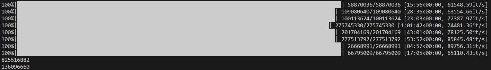

## Day 5: If You Give A Seed A Fertilizer

Source: [Advent of Code 2023 - Day 5](https://adventofcode.com/2023/day/5)

In [code.py](code.py) there is the working answer using bruteforce it took 4 hours.

---

There is also a second file  [OnlyPartTwo_wrongResult.py](OnlyPartTwo_wrongResult.py) that is my attempt to not making use bruteforce, at the end of the day I couldn't finish, it passed all the tests but when introducing the `input.txt` it gives me the wrong answer. 

That script is the one that has taken most time of all days until now.

